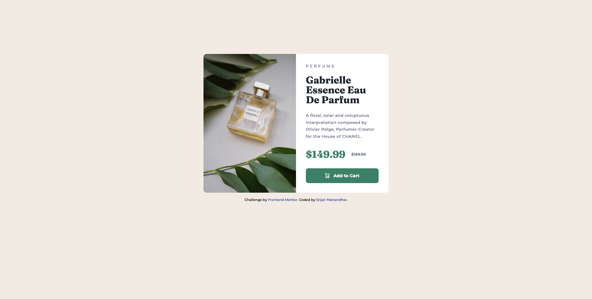

# Frontend Mentor - Product preview card component solution

This is a solution to the [Product preview card component challenge on Frontend Mentor](https://www.frontendmentor.io/challenges/product-preview-card-component-GO7UmttRfa). Frontend Mentor challenges help you improve your coding skills by building realistic projects.

## Table of contents

- [Overview](#overview)
  - [The challenge](#the-challenge)
  - [Screenshot](#screenshot)
  - [Links](#links)
- [My process](#my-process)
  - [Built with](#built-with)
  - [What I learned](#what-i-learned)
- [Author](#author)

## Overview

### The challenge

Users should be able to:

- View the optimal layout depending on their device's screen size
- See hover and focus states for interactive elements

### Screenshot




### Links

- Solution URL: [https://github.com/srijanss/product-preview-card-component](https://github.com/srijanss/product-preview-card-component)
- Live Site URL: [https://srijanss.github.io/product-preview-card-component/](https://srijanss.github.io/product-preview-card-component/)

## My process

### Built with

- Semantic HTML5 markup
- CSS custom properties
- Flexbox
- Mobile-first workflow
- [Vite](https://vitejs.dev/) - Lightweight frontend tooling
- [PostCSS](https://postcss.org/) - Tool to transform CSS using plugins

### What I learned

```html
<picture>
  <source
    media="(min-width: 768px)"
    srcset="./images/image-product-desktop.jpg"
  />
  
</picture>

<p class="product__price">
  <ins class="product__price--current"> $149.99 </ins>
  <del class="product__price--previous">$169.99</del>
</p>
```

```css
.product__image {
  @mixin full-width;
  border-radius: 0.625rem 0.625rem 0 0;

  @mixin media-query-desktop {
    flex: 1;
    height: 100%;
    border-radius: 0.625rem 0 0 0.625rem;
  }
}
```

I got to learn about HTML elements like <picture>, which can be used to add images of different size based on screen size. Also, got to learn about semantic elements like <ins> to show current price and <del> element to show the previous price.

I've use PostCSS and its different plugins

- learned about how we can separate CSS into different files and import into the main CSS file.
- used mixins which helps us to reuse CSS without repeating in different places.
- used nested CSS

And to build this postcss I've used 'Vite'. It is very helpful tool for development and also for deployment of production build to Github pages.

## Author

- Website - [Srijan Manandhar](https://github.com/srijanss)
- Frontend Mentor - [@srijanss](https://www.frontendmentor.io/profile/srijanss)
